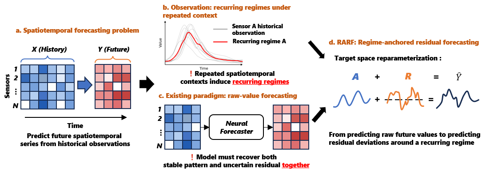
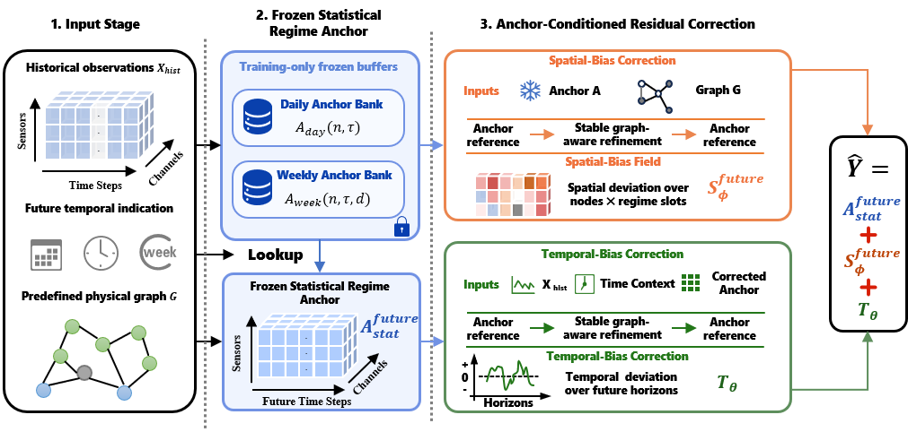

# RARF

Official research code for **Rethinking Spatiotemporal Series Forecasting via Regime-Anchored Residual Dynamics**.

RARF, short for **Regime-Anchored Residual Forecasting**, rethinks direct raw-value prediction in spatiotemporal series forecasting. The key idea is to reformulate forecasting as **offline regime summarization plus online residual correction**. Stable recurring spatiotemporal regime structure is represented by a frozen anchor field, and the neural model forecasts an anchor-conditioned residual correction around that anchor:

```text
Y_hat = A0_future + R_corr
```

- `A0_future`: frozen future Regime Anchor Field from train-only statistics.
- `R_corr`: anchor-conditioned residual correction around `A0_future`.

The default entrypoint trains the main RARF model path. Long-horizon and ablation experiments are included as explicit supplemental entrypoints and do not run unless requested.

## Overview

Most spatiotemporal forecasting models directly map historical observations to future raw values. RARF changes the prediction target instead of only increasing model expressiveness. It separates recurring node-specific temporal regimes from sample-specific deviations:

1. Offline, RARF summarizes training observations into a leakage-free Frozen Regime Anchor Field.
2. Online, future-available temporal indicators retrieve the corresponding future anchor.
3. The neural module predicts residual correction around that anchor.
4. Final forecasts are reconstructed as `Y_hat = A0_future + R_corr`.

This design is intended for data-intensive spatiotemporal forecasting systems where recurring regimes are strong, online inference should stay lightweight, and robustness to imperfect recent observations matters.

<p align="center">
  
</p>

## Quick Start

The recommended main experiment starts from **PEMS04**.

```bash
conda create -n STP python=3.11 -y
conda activate STP

python -m pip install --upgrade pip setuptools wheel
pip install torch==2.9.1 torchvision==0.24.1 torchaudio==2.9.1 --index-url https://download.pytorch.org/whl/cu128
python -m pip install numpy==2.2.6 pandas==2.2.3

python -m utils.prepare_data --datasets PEMS04 --artifact-mode split_npz
python -m utils.regime_anchor_field --dataset PEMS04
python main.py --config configs/PEMS04.json --device cuda --run-id pems04_rarf_seed1
```

The final test metrics are written to:

```text
output/runs/PEMS04/RARF/seed_1/pems04_rarf_seed1/test_metrics_by_horizon.csv
```

## News

- Submission-stage code release for the RARF paper.
- This release keeps the RARF main path as the default runnable path.
- Long-horizon forecasting configs and ablation scripts are provided as explicit paper-analysis entrypoints.
- The experiments cover six spatiotemporal forecasting benchmarks: PEMS03, PEMS04, PEMS07, PEMS08, METR-LA, and PEMS-BAY.
- Raw benchmark files are included under `datasets/raw_data/`; generated split assets, checkpoints, outputs, and temporary result folders are intentionally excluded from git.

## Method

RARF is a target-space reparameterization framework. The frozen anchor defines the coordinate system of the prediction target, and the neural network learns how each sample deviates from this train-only regime reference.

<p align="center">
  
</p>

### Frozen Regime Anchor Field

RARF builds train-only statistical anchors:

```text
A_daily(n, tau) = mean_train(y | node=n, TOD=tau)
A_weekly_res(n, tau, d) = mean_train(y | node=n, TOD=tau, DOW=d) - A_daily(n, tau)
A0(n, tau, d) = A_daily(n, tau) + A_weekly_res(n, tau, d)
```

The weekly file stores a day-specific residual, not a complete weekly mean.

### Anchor-Conditioned Residual Correction

RARF predicts:

```text
R_corr = R_spatial + R_temporal
Y_hat = A0_future + R_corr
```

- **Spatial-Bias Correction Branch** learns context-level spatial residual correction around the frozen anchor:

```text
R_spatial = T_phi(A0 + E_table + lambda * LowRank(node, regime)) - A0
```

- **Temporal-Bias Correction Branch** predicts history-conditioned temporal residual correction.

The default objective is final MAE on `Y_hat`. Optional FFT magnitude loss is available through `train.fft_loss_weight`; the release baseline keeps it at `0.0`.

## Contributions Reflected in This Code

- Train-only Frozen Regime Anchor Field construction for recurring node-time regimes.
- Anchor-conditioned residual correction with separate spatial-bias and temporal-bias correction branches.
- Main 12-step forecasting experiments on traffic-flow and traffic-speed datasets.
- Explicit supplemental entrypoints for long-horizon forecasting and ablation studies.

## Environment

The reference server environment is:

```bash
conda create -n STP python=3.11 -y
conda activate STP

python -m pip install --upgrade pip setuptools wheel
pip install torch==2.9.1 torchvision==0.24.1 torchaudio==2.9.1 --index-url https://download.pytorch.org/whl/cu128
python -m pip install numpy==2.2.6 pandas==2.2.3
```

Alternatively:

```bash
conda env create -f environment.yml
conda activate STP
```

or, inside an existing Python 3.11 environment:

```bash
python -m pip install --upgrade pip setuptools wheel
python -m pip install -r requirements.txt
```

Full training is intended for CUDA GPUs. CPU execution is useful for syntax checks and small smoke tests only.

## Data

Raw benchmark files are provided under `datasets/raw_data/`. For the main PEMS04 experiment, the expected raw files are:

```text
datasets/raw_data/PEMS04/PEMS04.npz
datasets/raw_data/PEMS04/PEMS04.csv
```

PEMS03 additionally uses `PEMS03.txt` for graph node IDs. METR-LA and PEMS-BAY use HDF5 files and DCRNN-style graph pickle files.

Supported dataset names in this codebase:

| Dataset | Target | Nodes | Raw data file | Graph file |
| --- | --- | ---: | --- | --- |
| PEMS03 | flow | 358 | `PEMS03.npz` | `PEMS03.csv`, `PEMS03.txt` |
| PEMS04 | flow | 307 | `PEMS04.npz` | `PEMS04.csv` |
| PEMS07 | flow | 883 | `PEMS07.npz` | `PEMS07.csv` |
| PEMS08 | flow | 170 | `PEMS08.npz` | `PEMS08.csv` |
| METR-LA | speed | 207 | `metr-la.h5` | `adj_mx.pkl` |
| PEMS-BAY | speed | 325 | `pems-bay.h5` | `adj_mx_bay.pkl` |

Prepare chronological split NPZ artifacts:

```bash
python -m utils.prepare_data --datasets PEMS04 --artifact-mode split_npz
```

Build the train-only Regime Anchor Field:

```bash
python -m utils.regime_anchor_field --dataset PEMS04
```

Equivalent wrapper:

```bash
python scripts/build_assets.py --dataset PEMS04
```

Required runtime files after preparation:

```text
datasets/PEMS04/train.npz
datasets/PEMS04/val.npz
datasets/PEMS04/test.npz
datasets/PEMS04/graphs/A_0.pkl
datasets/PEMS04/graphs/A_phy.pkl
datasets/PEMS04/anchors/regime_anchor_field_daily.npy
datasets/PEMS04/anchors/regime_anchor_field_weekly.npy
datasets/PEMS04/anchors/regime_anchor_field_metadata.json
```

Only raw files under `datasets/raw_data/` are tracked. Generated split and anchor assets under `datasets/<DATASET>/` should be prepared locally and are ignored by git.

## Training

Main PEMS04 command:

```bash
python main.py --config configs/PEMS04.json --device cuda --run-id pems04_rarf_seed1
```

Thin script wrapper:

```bash
python scripts/train.py --config configs/PEMS04.json --device cuda --run-id pems04_rarf_seed1
```

Main PEMS reproduction commands:

```bash
python main.py --config configs/PEMS03.json --device cuda --run-id pems03_rarf_seed1
python main.py --config configs/PEMS04.json --device cuda --run-id pems04_rarf_seed1
python main.py --config configs/PEMS07.json --device cuda --run-id pems07_rarf_seed1
python main.py --config configs/PEMS08.json --device cuda --run-id pems08_rarf_seed1
```

Optional multi-run helper:

```bash
python scripts/train_all.py --profile nofft --device cuda
python scripts/train_all.py --profile fft001 --device cuda
python scripts/train_all.py --profile both --device cuda
```

`--profile nofft` uses `configs/<DATASET>.json`; `--profile fft001` uses `configs/<DATASET>_fft001.json`.

## Overall Performance

All results are averaged over five runs. Lower values are better.

| Dataset | MAE | RMSE | MAPE |
| --- | ---: | ---: | ---: |
| PEMS03 | 15.00 | 26.69 | 15.02% |
| PEMS04 | 17.98 | 30.49 | 11.90% |
| PEMS07 | 19.18 | 33.49 | 8.04% |
| PEMS08 | 13.37 | 23.11 | 8.86% |
| PEMS-BAY | 1.53 | 3.57 | 3.45% |
| METR-LA | 3.01 | 6.19 | 8.45% |

## Long-Horizon Forecasting

Long-horizon configs are under `configs/longtime/` for horizons 24, 36, 48, and 60. They are not used by the default 12-step main experiments.

Prepare long-horizon split assets locally, for example:

```bash
python -m utils.prepare_data --datasets PEMS04 --processed-root longtimeforecasting/h24 --history-length 24 --horizon 24 --artifact-mode split_npz
python -m utils.regime_anchor_field --dataset PEMS04 --train-npz longtimeforecasting/h24/PEMS04/train.npz --anchor-asset-dir longtimeforecasting/h24/PEMS04/anchors
python main.py --config configs/longtime/PEMS04_h24.json --device cuda --run-id pems04_h24_rarf_seed1
```

`longtimeforecasting/` is generated data and is intentionally ignored by git.

## Ablation Studies

Ablation scripts live under `ablation/` and are isolated from the main `main.py` RARF training path. They write outputs to:

```text
output/runs/<dataset>/RARF_ABLATION/<variant>/seed_<seed>/<run_id>/
```

Examples:

```bash
python ablation/evaluate_anchor_only.py --config configs/PEMS04.json --device cuda --run-id pems04_anchor_only_seed1
python ablation/train_ablation.py --config configs/PEMS04.json --variant no-spatial-branch --device cuda --run-id pems04_no_spatial_seed1
python ablation/train_direct_prediction.py --config configs/PEMS04.json --device cuda --run-id pems04_direct_prediction_seed1
```

Available ablation variants:

```text
anchor-only
direct-prediction
no-anchor-coordinate
no-fft-loss
no-future-time
no-regime-anchor
no-spatial-branch
no-temporal-branch
```

These scripts are for paper analysis only. The released main forecast formula remains `Y_hat = A0_future + R_corr`.

## Outputs

Runs are written to:

```text
output/runs/<dataset>/RARF/seed_<seed>/<run_id>/
```

Important files:

```text
history.csv
test_metrics_by_horizon.csv
checkpoints/best.pt
```

`output/` and checkpoint files are intentionally ignored by git.

## Repository Layout

```text
main.py                                      CLI, runtime setup, training
configs/                                    slim dataset configs
configs/longtime/                           explicit long-horizon configs
dataloader/                                 split NPZ and windowed loaders
models/rarf.py                              top-level A0_future + R_corr orchestration
models/frozen_regime_anchor/                Frozen Regime Anchor lookup
models/anchor_conditioned_residual_correction/ Spatial-Bias and Temporal-Bias Correction branches
engine/                                     training, evaluation, checkpoints
utils/regime_anchor_field/                  train-only regime anchor asset builder
scripts/                                    thin command wrappers
ablation/                                   explicit paper ablation entrypoints
```

The GitHub release intentionally excludes generated data, training outputs, checkpoints, old baselines, external references, and temporary figure/result folders.

## Reproducibility Notes for ICDE 2027

Use the reference environment above, rebuild data and anchors from train-only splits, then run the commands in `Training`. Reported metrics are read from:

```text
output/runs/<dataset>/RARF/seed_<seed>/<run_id>/test_metrics_by_horizon.csv
```

For `data.target_value_type = "flow"`, MAE/RMSE use all finite labels, including zero flow, and MAPE excludes zero denominators. For `speed`, zero values are treated as missing for targets and inputs.

The default 12-step main experiment is independent from long-horizon and ablation scripts. Those supplemental experiments only run when their explicit configs or scripts are invoked.

## Checks

Syntax check:

```bash
python -m compileall main.py models utils dataloader engine scripts ablation
```

Config check:

```bash
python -c "from utils.config import load_config, resolve_runtime_config; resolve_runtime_config(load_config('configs/PEMS04.json'))"
```

One-epoch smoke run:

```bash
python main.py --config configs/PEMS04.json --device cuda --epochs 1 --run-id smoke_pems04_rarf
```

## Citation

If you use this repository, please cite the corresponding RARF paper. The final BibTeX entry will be added after the paper metadata is finalized.
