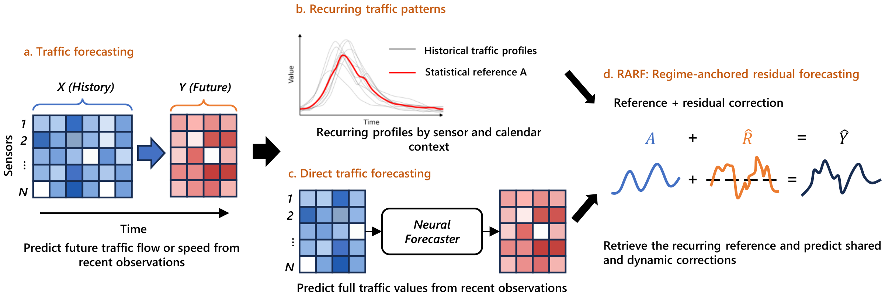
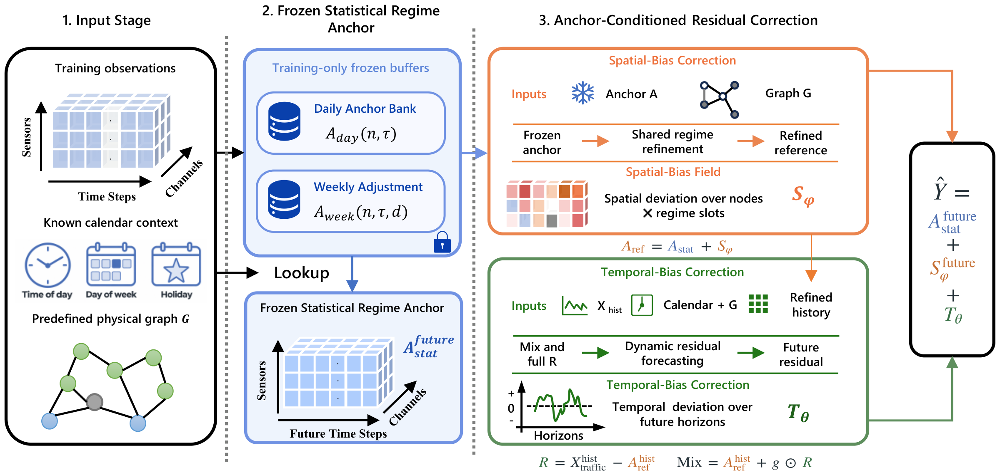

# RARF

Official PyTorch implementation of **Efficient Traffic Forecasting via Regime-Anchored Residual Learning**.

**Cang Qin · Lina Yang · Ling Peng**

RARF (**Regime-Anchored Residual Forecasting**) uses recurring daily and weekly traffic patterns as an explicit forecasting reference. It learns road-network relationships within a shared reference and predicts future departures from recent observations. An adaptive reference–observation mixture and a full historical residual channel give the dynamic predictor access to both recurring traffic levels and the current traffic state.

[Overview](#overview) · [Method](#method) · [Results](#results) · [Quick Start](#quick-start) · [Data and Reproduction](#data-and-reproduction) · [Citation](#citation)

## Overview

Traffic flow and speed often follow recurring patterns at the same sensor, time of day, and day of week. Recent traffic can depart from these patterns because of changing conditions and short-term disturbances. RARF brings these two sources of information together:

1. **Summarize recurring traffic.** Fixed daily and weekly statistics are computed from the training split for each sensor.
2. **Learn a shared road-network reference.** Graph propagation and attention over sensors and calendar slots refine these statistics.
3. **Predict current departures.** Historical traffic is encoded using both a reference–observation mixture and the full residual, then used to predict future corrections.

Known timestamps retrieve historical and future reference values, providing daily and weekly context even when the input contains only the latest hour of traffic observations.

<p align="center">
  
</p>

*Traffic periodicity motivates forecasting around a recurring reference. The anchor and learned corrections together reconstruct the future traffic signal.*

The manuscript evaluates forecasting accuracy together with resource use:

- **Six traffic benchmarks:** PEMS03, PEMS04, PEMS07, PEMS08, METR-LA, and PEMS-BAY.
- **Best or tied-best results on 16 of 18 metric–dataset combinations** among the evaluated manuscript baselines.
- **On PEMS07, 63.0% lower peak GPU memory and 25.1% lower inference latency than STWave**, together with a 2.6% reduction in MAE.

## Method

<p align="center">
  
</p>

*Blue denotes the statistical anchor, orange the shared spatial correction and refined reference, and green the history-conditioned dynamic correction. Mix and R denote the reference-conditioned input and full historical residual.*

### 1. Statistical anchor from recurring traffic

For sensor $n$, time-of-day slot $\tau$, and day-of-week index $d$, the training-only statistics are

$$
\begin{aligned}
A_{\mathrm{day}}(n,\tau)
&= \mathrm{mean}_{\mathrm{train}}(y\mid n,\tau),\\
A_{\mathrm{week}}(n,\tau,d)
&= \mathrm{mean}_{\mathrm{train}}(y\mid n,\tau,d)-A_{\mathrm{day}}(n,\tau),\\
A_{\mathrm{stat}}(n,\tau,d)
&= A_{\mathrm{day}}(n,\tau)+A_{\mathrm{week}}(n,\tau,d).
\end{aligned}
$$

The daily profile and weekly adjustment are stored as fixed buffers. Calendar indices select the relevant entries for historical and future timestamps. Future lookup uses known calendar information only.

### 2. Shared graph-aware reference

The **Spatial-Bias Correction Branch** uses the statistical banks and physical road graph to learn recurring relationships across sensors and calendar slots. Its output refines the anchor into an effective reference:

$$
A_{\mathrm{ref}}(n,c)=A_{\mathrm{stat}}(n,c)+S_{\phi}(n,c).
$$

For fixed model parameters, windows with the same sensor and calendar context share this reference. The branch does not take the current observation window as input. The statistical anchor is fixed, while the effective reference is learned jointly with the dynamic predictor.

### 3. History-conditioned residual prediction

The **Temporal-Bias Correction Branch** describes recent traffic relative to the learned reference:

$$
\begin{aligned}
R_{\mathrm{hist}}&=X_{\mathrm{traffic}}^{\mathrm{hist}}-A_{\mathrm{ref}}^{\mathrm{hist}},\\
X_{\mathrm{anchor}}&=A_{\mathrm{ref}}^{\mathrm{hist}}+g\odot R_{\mathrm{hist}}.
\end{aligned}
$$

Residual statistics guide the mixture weight $g$. The encoder receives both $X_{\mathrm{anchor}}$ and the full $R_{\mathrm{hist}}$, together with missing-observation indicators and calendar features. The mixture controls the contribution of recurring levels, while the separate residual channel preserves deviations at every historical step.

Temporal convolutions and fixed-graph propagation encode the history. A horizon-conditioned readout and future calendar embeddings support the dynamic correction. The forecast is reconstructed as

$$
\hat Y=A_{\mathrm{stat}}^{\mathrm{future}}+S_{\phi}^{\mathrm{future}}+T_{\theta}
=A_{\mathrm{ref}}^{\mathrm{future}}+T_{\theta}.
$$

Reference attention operates on shared calendar banks, while the dynamic path processes individual windows. The released implementation performs the reference transformations online; the resource measurements below include these transformations and the dynamic predictor.

The full-model objective combines masked MAE on the original traffic scale with an auxiliary FFT magnitude loss of weight **0.01**. The recommended `configs/*_fft001.json` files use this setting with batch size **16**.

## Results

### Forecasting accuracy

The following results are reported in the current manuscript. Each value is averaged over all 12 forecast steps and five independent runs. With five-minute sampling, the main setting uses the past hour to predict the next hour. Lower values are better.

| Dataset | Target | MAE | RMSE | MAPE |
| --- | --- | ---: | ---: | ---: |
| PEMS03 | Flow | 14.00 | 25.54 | 14.99% |
| PEMS04 | Flow | 17.98 | 30.49 | 11.90% |
| PEMS07 | Flow | 19.18 | 33.49 | 8.04% |
| PEMS08 | Flow | 13.37 | 23.11 | 8.86% |
| METR-LA | Speed | 2.96 | 6.02 | 8.17% |
| PEMS-BAY | Speed | 1.53 | 3.57 | 3.45% |

On PEMS03 and METR-LA, the reported improvements over the best baseline are statistically significant ($t$-test, $p<0.05$).

### Accuracy and resource use on PEMS07

The manuscript measures complete-model inference on a single **NVIDIA RTX 5090 32GB**, with **batch size 16** and **12-step history and prediction**. Inference time is measured per batch of 16 windows.

| Method | FLOPs (G) | Peak GPU memory (MB) | Inference time (ms/batch) | MAE |
| --- | ---: | ---: | ---: | ---: |
| PDFormer | 319.9 | 5314.4 | 190.0 | 20.16 |
| STAEformer | 624.1 | 5054.5 | 61.3 | 20.06 |
| D2STGNN | 836.5 | 2543.6 | 97.3 | 20.42 |
| STWave | 289.5 | 2110.3 | 40.2 | 19.70 |
| **RARF** | **240.1** | **780.7** | **30.1** | **19.18** |
| Reduction vs. STWave | 17.1% | 63.0% | 25.1% | 2.6% |

The manuscript also evaluates longer histories and horizons together ($L=H\in\lbrace24,36,48,60\rbrace$), component ablations, and prediction under delayed, held-constant, or biased historical traffic observations.

## Quick Start

The example below runs **PEMS04** with the full-model FFT setting. Install Git and [Git LFS](https://git-lfs.com/) before cloning; the large raw benchmark files are tracked with Git LFS.

```bash
git lfs install
git clone https://github.com/StevenQin0920/RARF.git
cd RARF
git lfs pull

conda create -n STP python=3.11 -y
conda activate STP
python -m pip install --upgrade pip setuptools wheel
python -m pip install -r requirements.txt

python -m utils.prepare_data --datasets PEMS04 --artifact-mode split_npz
python -m utils.regime_anchor_field --dataset PEMS04
python main.py --config configs/PEMS04_fft001.json --device cuda --run-id pems04_rarf_fft001_seed1
```

The test metrics are written to:

```text
output/runs/PEMS04/RARF/seed_1/pems04_rarf_fft001_seed1/test_metrics_by_horizon.csv
```

This command performs **one run with seed 1**. The manuscript table reports five-run means; see [Repeated runs](#repeated-runs) for the corresponding procedure.

The supplied environment uses Python 3.11, PyTorch 2.9.1 with CUDA 12.8 wheels, NumPy 2.2.6, pandas 2.2.3, and PyTables 3.10.2. As an alternative to the environment and package-installation commands above:

```bash
conda env create -f environment.yml
conda activate STP
```

Training is intended for a CUDA GPU. The environment specifications are in [`requirements.txt`](requirements.txt) and [`environment.yml`](environment.yml).

## Data and Reproduction

### Dataset files and preparation

Raw benchmark assets are stored under `datasets/raw_data/`. After cloning, run `git lfs pull` to retrieve the actual data rather than just the small pointer files.

| Dataset | Target | Sensors | Raw data file | Graph files |
| --- | --- | ---: | --- | --- |
| PEMS03 | Flow | 358 | `PEMS03/PEMS03.npz` | `PEMS03/PEMS03.csv`, `PEMS03/PEMS03.txt` |
| PEMS04 | Flow | 307 | `PEMS04/PEMS04.npz` | `PEMS04/PEMS04.csv` |
| PEMS07 | Flow | 883 | `PEMS07/PEMS07.npz` | `PEMS07/PEMS07.csv` |
| PEMS08 | Flow | 170 | `PEMS08/PEMS08.npz` | `PEMS08/PEMS08.csv` |
| METR-LA | Speed | 207 | `METR-LA/metr-la.h5` | `sensor_graph/METR-LA/adj_mx.pkl` |
| PEMS-BAY | Speed | 325 | `PEMS-BAY/pems-bay.h5` | `sensor_graph/PEMS-BAY/adj_mx_bay.pkl` |

All paths in this table are relative to `datasets/raw_data/`. To prepare the six datasets and their anchors:

```bash
python -m utils.prepare_data --datasets PEMS03 PEMS04 PEMS07 PEMS08 METR-LA PEMS-BAY --artifact-mode split_npz --rarf-assets
```

For the standard 12-step setting, the generated assets for each dataset are:

```text
datasets/<DATASET>/
├── train.npz
├── val.npz
├── test.npz
├── graphs/
│   ├── A_0.pkl
│   └── A_phy.pkl
└── anchors/
    ├── regime_anchor_field_daily.npy
    ├── regime_anchor_field_weekly.npy
    └── regime_anchor_field_metadata.json
```

The weekly anchor file stores the day-specific adjustment to the daily profile. Generated splits, anchor assets, outputs, and checkpoints are prepared locally and ignored by Git.

### Training the six datasets

Use the supplied FFT-weight-0.01 configurations:

```bash
python main.py --config configs/PEMS03_fft001.json --device cuda --run-id pems03_rarf_fft001_seed1
python main.py --config configs/PEMS04_fft001.json --device cuda --run-id pems04_rarf_fft001_seed1
python main.py --config configs/PEMS07_fft001.json --device cuda --run-id pems07_rarf_fft001_seed1
python main.py --config configs/PEMS08_fft001.json --device cuda --run-id pems08_rarf_fft001_seed1
python main.py --config configs/METR-LA_fft001.json --device cuda --run-id metrla_rarf_fft001_seed1
python main.py --config configs/PEMS-BAY_fft001.json --device cuda --run-id pemsbay_rarf_fft001_seed1
```

Alternatively, run all six datasets sequentially:

```bash
python scripts/train_all.py --profile fft001 --device cuda
```

To inspect the generated commands without launching training:

```bash
python scripts/train_all.py --profile fft001 --device cuda --dry-run
```

The `configs/<DATASET>.json` files remain available with FFT loss disabled and their existing per-dataset batch sizes. The `nofft` and `both` profiles of `scripts/train_all.py` select those settings or run both configuration families, respectively. The full-model commands above explicitly select `fft001`.

### Repeated runs

Each checked-in main configuration sets `train.seed` to `1`. For a five-run evaluation, use five distinct values of **`train.seed`** in local copies of the same configuration, keep the data split and other settings fixed, and use a distinct `--run-id` for each run. Average the `avg` rows in the resulting `test_metrics_by_horizon.csv` files.

`--run-id` labels an output directory; changing it does not change the random seed. The multi-dataset helper runs each selected dataset and profile once with its configured seed.

### Evaluation protocol

- Data are split chronologically: **6:2:2** for flow datasets and **7:1:2** for speed datasets.
- Traffic standardization and statistical anchor construction use the training split only.
- For flow, MAE and RMSE include valid zero-flow values; MAPE excludes zero denominators.
- For speed, zero readings are treated as missing for targets and inputs.
- The CSV `avg` row reports metrics averaged over the forecast horizon. MAPE is stored as a ratio in the CSV; multiply by 100 to display the percentages used in the table above.

### Longer-horizon forecasting

The configs in `configs/longtime/` use **$L=H$** with horizons 24, 36, 48, and 60: the past 2–5 hours are used to predict the next 2–5 hours. Prepare separate assets for each sequence length. For example:

```bash
python -m utils.prepare_data --datasets PEMS04 --processed-root longtimeforecasting/h24 --history-length 24 --horizon 24 --artifact-mode split_npz
python -m utils.regime_anchor_field --dataset PEMS04 --train-npz longtimeforecasting/h24/PEMS04/train.npz --anchor-asset-dir longtimeforecasting/h24/PEMS04/anchors
python main.py --config configs/longtime/PEMS04_h24.json --device cuda --run-id pems04_h24_rarf_seed1
```

`longtimeforecasting/` contains locally generated data and is ignored by Git. These experiments use their own configs and are separate from the main 12-step runs.

### Component ablations

The [`ablation/`](ablation/) directory contains diagnostic and training entrypoints for Anchor Only, Direct Prediction, and component-removal variants. For example:

```bash
python ablation/evaluate_anchor_only.py --config configs/PEMS04_fft001.json --device cuda --run-id pems04_anchor_only_seed1
python ablation/train_ablation.py --config configs/PEMS04_fft001.json --variant no-spatial-branch --device cuda --run-id pems04_no_spatial_seed1
python ablation/train_direct_prediction.py --config configs/PEMS04_fft001.json --device cuda --run-id pems04_direct_prediction_seed1
```

Available variants are `anchor-only`, `direct-prediction`, `no-anchor-coordinate`, `no-fft-loss`, `no-future-time`, `no-regime-anchor`, `no-spatial-branch`, and `no-temporal-branch`. Ablation outputs are written under `output/runs/<DATASET>/RARF_ABLATION/`.

### Outputs and basic checks

Main-model runs use the following layout:

```text
output/runs/<DATASET>/RARF/seed_<SEED>/<RUN_ID>/
├── history.csv
├── test_metrics_by_horizon.csv
└── checkpoints/
    └── best.pt
```

Syntax and configuration checks:

```bash
python -m compileall main.py models utils dataloader engine scripts ablation
python -c "from utils.config import load_config, resolve_runtime_config; resolve_runtime_config(load_config('configs/PEMS04_fft001.json'))"
```

After preparing the data, a one-epoch smoke run can check the training path:

```bash
python main.py --config configs/PEMS04_fft001.json --device cuda --epochs 1 --run-id smoke_pems04_rarf
```

## Repository Layout

```text
main.py                                      Training and evaluation entrypoint
configs/                                     Main experiment configurations
configs/longtime/                             Longer-history/horizon configurations
dataloader/                                  Split assets, loaders, and scaling
models/rarf.py                                Anchor, shared correction, and dynamic prediction
models/frozen_regime_anchor/                  Frozen statistical anchor lookup
models/anchor_conditioned_residual_correction/ Spatial and temporal correction branches
engine/                                      Training, evaluation, and checkpoints
utils/regime_anchor_field/                    Training-only statistical profile construction
scripts/                                     Training and data-preparation helpers
ablation/                                    Component and diagnostic experiments
docs/figures/                                Method and motivation figures
```

## Citation

If you use RARF in your research, please cite the associated manuscript:

> Cang Qin, Lina Yang, and Ling Peng. **Efficient Traffic Forecasting via Regime-Anchored Residual Learning**.

Publication details and a final BibTeX entry will be added when available.
